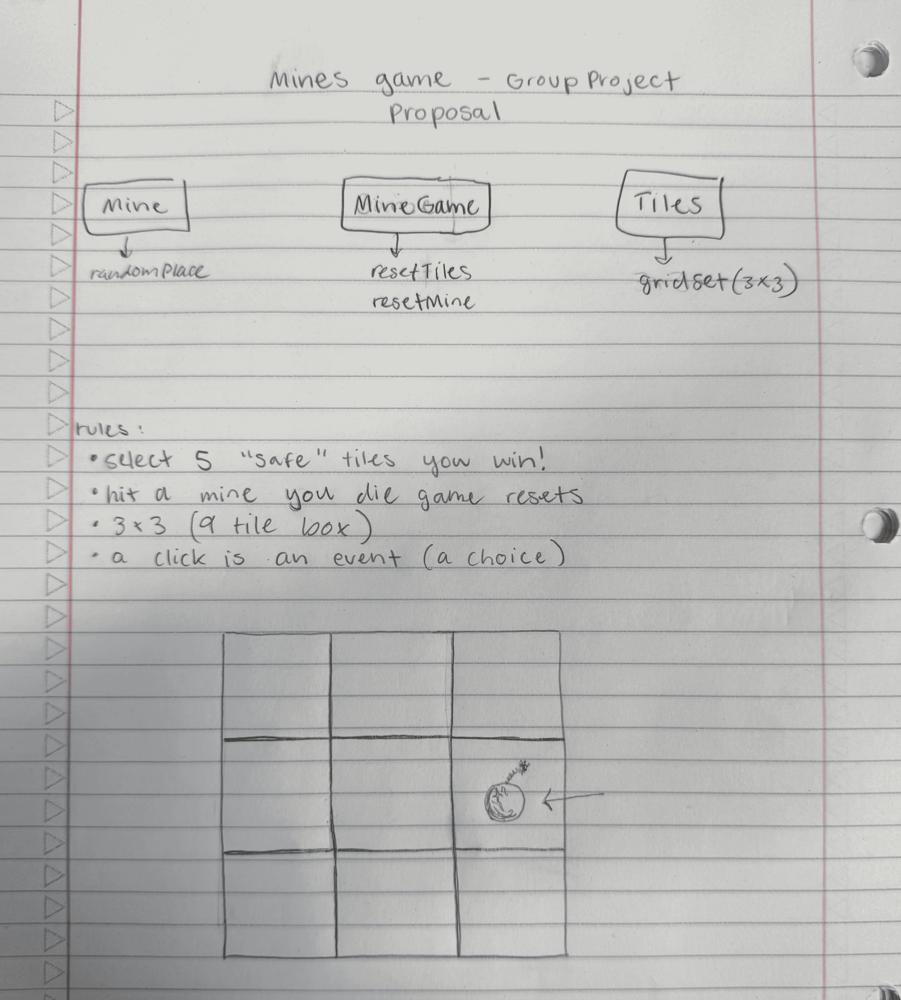

## Project Proposal

## Mine Game
Create a 3x3 grid
Figure out how the mine is assigned randomly
Accept your movements/click on the grids

## Group Description
Don't blow up!

## About the game
Mine is interesting/ cool because of its simplicity as programmers and non programmers can play the game through the power of abstraction.
It is also addictive and entertaining as it keeps you on your toes.

## Team Members
1. Dane DeDominces
2. Shaylee O'Grady
3. Misha N. Awan
## Sketch of the Game

## How the Game works
1. Upon clicking on play, the user is presented with a 3x3 grid
2. The grids are concealed
3. A mine is randomly place on one of the grid
4. The user tries to uncover the grids without clicking on the one with the mine
5. If the mine is clicked, the game displays " You died" 
6. if the mine is not clicked in five tries, the user is declared the winner.
7. Click on play again if you would like to play again.

## How to Play
1. Click Play to start the game. A hidden 3×3 grid will appear.
2. Behind one random grid is a hidden mine .
3. Click on gridss one at a time to reveal them.
4. If you click the grid with the mine →  Game Over (“You died”).
5. If you reveal 5 safe grids without hitting the mine →  You win!
6. Once the game ends, click Play Again to restart with a new random mine position.

